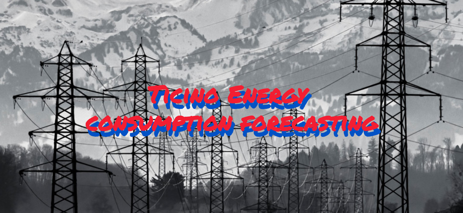

# How to forecast energy consumption for the Ticino region

#### -- Project Status: [Completed]

## Objective
Even tough I still haven't revised Deep Learning and Tensorflow yet, I decided to analyze the power grid energy consumption in Ticino (Switzerland) from 2018 to 2022. Instead of going back to the notebooks I used during my bootcamp, I decided to find a walkthrough and adapt it to the data I used for this project. The goal was to recreate and adapt a walkthrough based on existing sources online and replicate LSTM for the dataset selected.

### Notebooks
* [ticino_energy_consumption_forecasting](ticino_energy_consumption_forecasting.ipynb)

### Data
* [Aggregated energy data of the control block Switzerland](https://www.swissgrid.ch/en/home/customers/topics/energy-data-ch.html)

### Sources
* [How to develop LSTM models for time series forecasting](https://machinelearningmastery.com/how-to-develop-lstm-models-for-time-series-forecasting/)
* [Energy consumption time series forecasting](https://towardsdatascience.com/energy-consumption-time-series-forecasting-with-python-and-lstm-deep-learning-model-7952e2f9a796)

### Technologies and packages
* Python
* Numpy
* Matplotlib
* Keras
* Tensorflow
* Scikit-learn
